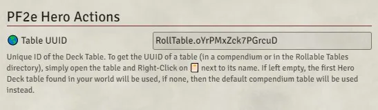

# FoundryVTT PF2e Hero Actions

https://www.youtube.com/watch?v=8EezVnYQKyo

This module integrates and automates the `Hero Deck` actions into the PF2e system.

It adds a new section in the `actions` tab of the character sheet where a player can **Draw**, **Discard** or **Use** `Hero Actions` in concert with the regular `Hero Points`.

It works as follow:

-   If the character has more `Hero Points` than `Hero Actions`, the player will be asked to **Draw** new `Hero Actions` to fill in.

-   If the character has more `Hero Actions` than `Hero Points`, the player will be asked to **Discard** the excess of `Hero Actions`.

-   Otherwise the player will have the opportunity to **Use** any `Hero Actions` that are available to them, doing so will also spend one `Hero Point` from the character pool.

# Unique draw pool

By default, characters will draw randomly from a `hero Action` table without regard for which actions have already been drawn before.

If you want to have an unique action pool from which the actions are "removed" on draw until the pool is emptied (at which point, the pool will be refilled), you need to have a physical `Table` in your world.

Simply import the table from the compendium and uncheck the `Draw With Replacement?` option.

# Custom table

You can also have your own `Hero Actions` and table to draw them, to do so, you will need valid journal entries (in your world or in a compendium) and a table used to draw them.

Because the module cannot infer which table you are using in the case of a custom table, you will need to provide its UUID manually in the settings, to do so, open your table and `Right-Click` on the 📔 next to its name in the title bar, this will copy its UUID to your clipboard.

# Trading

Characters can trade `Hero Action` between each others.

If the initiating player is the owner of both characters (or is the GM), the trade will automatically be accepted.

The owner of the character traded with will receive a request popup and can accept or refuse the deal offered. If the player is not online, the GM will receive the request instead.

# Macros

## Table Creation

A macro has been added to the compendium to help you setup up your table.

You will be prompted with the option to create a `Default` or `Custom` table and if this table should or not use the `Unique Draw` feature.

When using that macro, the table will be created into your world with an obvious name and its UUID will also automatically be added to the settings.

## Remove Hero Actions

A macro has been added to the compendium to help you remove all the actions present on the `Characters` of your world.

You will be prompted with the list of the `Characters` from whom you want the actions to be removed.
